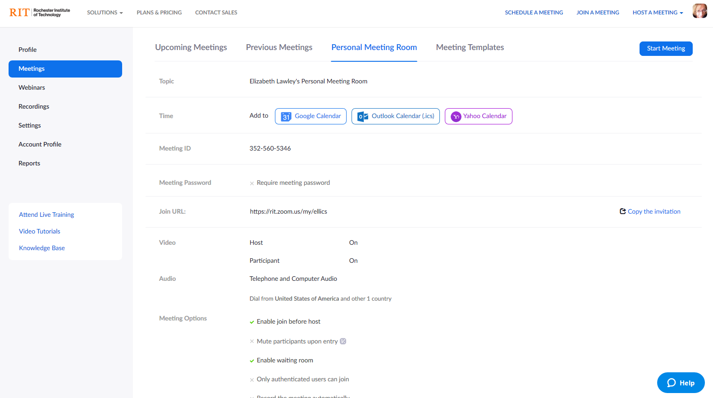
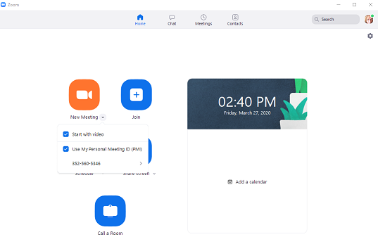

# Your Personal Zoom Meeting Room/ID[*](#notes)

All Zoom users have a "personal meeting ID", aka a personal meeting room. 

On your RIT Zoom Meetings page (https://rit.zoom.us/profile/meeting), one of the headings along the top of the page is for your Personal Meeting Room. 

In addition to a unique and persistent Meeting ID, the personal meeting room has a custom "Join URL". RIT users cannot modify this custom URL, because it uses your RIT user ID. 

You do not need to schedule this meeting in order to join it (although you can), nor does the ID or join URL change. Think of this like the virtual version of your physical office. You can post the URL in the same way you might post your office location. Anyone can stop by, but you can limit whether and when they can enter. (See the section on settings, below).

## Using Your Personal Meeting Room

You have three ways to enter your personal meeting room. 

1) From the Meetings page shown in the image above, click on the "Start Meeting" button in the top right corner. This should launch your Zoom client and open your room. 

2) From the Zoom client, click on the downward-facing arrow below the orange "New Meeting" button. You can start a new ("instant") meeting using your Personal ID/meeting room, or you can create a new one-time meeting. You can also specify whether you want to start the meeting with your video on or off. Select the "Use My Personal Meeting ID (PMI), and then click on the orange button to launch your meeting room. 

3) In a browser, enter the Join URL for your meeting room; it will launch the Zoom client and take you to your room. 

3) When you schedule a meeting using the RIT Zoom page or the Schedule button in your client, you have the option to either generate a unique ID and URL for the meeting, or use your personal meeting ID. If you choose to use your ID, you can either join the meeting as described in any of the options above, or you can go to the "Upcoming Meetings" section of the RIT Zoom page and click on the "start meeting" button. 

## Personal Meeting Room Settings
You can edit the settings for your personal meeting room by scrolling to the bottom of the page, and clicking on the Edit button. Things you can change are:
- Requiring a password (by default, it does not)
- Setting default video as on or off for yourself and for participants
- Specifying whether participants can join only by telephone, only by computer, or using either one
- Allowing participants to join the meeting even if you haven't yet logged in (if you do this, I recommend also setting up a waiting room)
- Muting participant audio when they first join
- Setting up a waiting room for participants, which requires you to admit them to the video chat (I've also written up [a separate document on how waiting rooms work](zoomWaitingRoom.md).)
- Limiting access to authenticated users
- Automatically recording the meeting

You can also designate alternative hosts who can manage the room in your absence (like a TA, for instance). 

When you're done, click Save to implement your changes. 

Any settings you change will remain in place until you return to this Settings page to modify them.

---
#### Notes
*This guide was written for faculty at RIT, using the university's interface to our licensed educational Zoom implementation; some features may not be available for personal accounts or other university implementations.