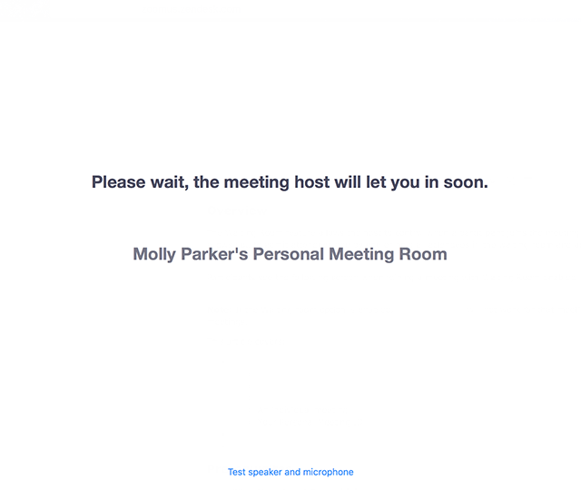
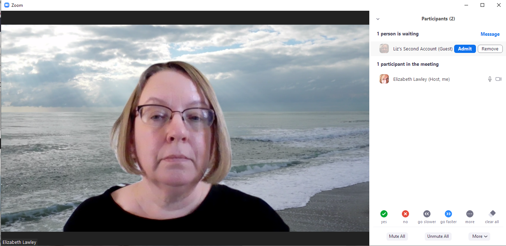
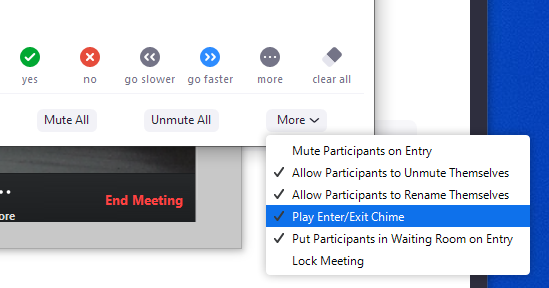
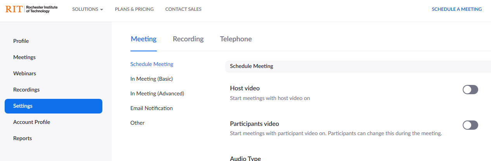
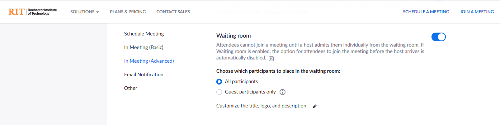
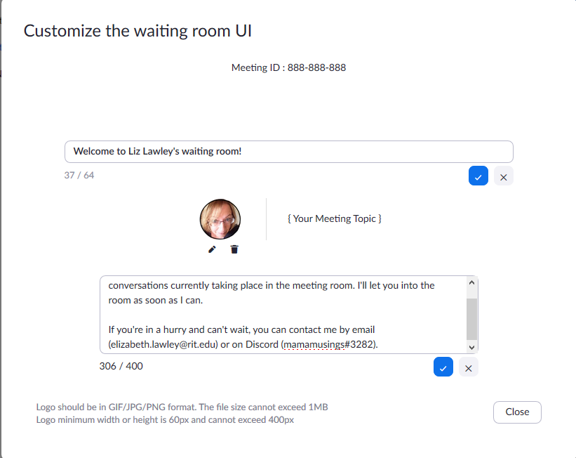
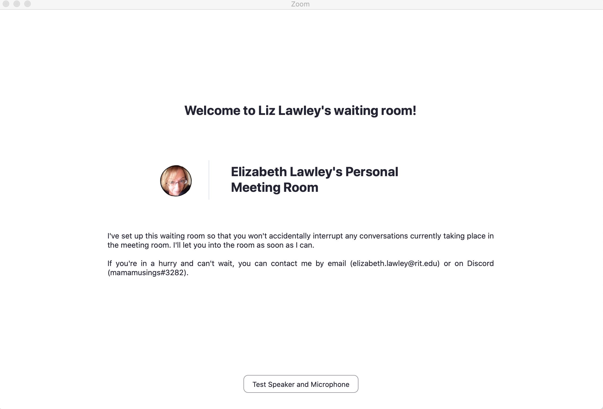

# Using and Customizing Your Zoom Waiting Room[*](#notes)

When scheduling a meeting (or [customizing your Personal Meeting Room](personalMeetingRoom.md)), you have the option to set up a "waiting room".

Waiting rooms are particularly useful for your personal meeting room, since it prevents new participants from intruding on a conversation you're already having in your "virtual office." 

When a participant joins a meeting with the waiting room enabled, they'll see a screen telling them that the meeting host will let them in soon: 

## Managing Your Waiting Room

When a new participant joins your meeting while the waiting room is enabled, if you don't already have the "manage participants" pane open, you should see a notification pop up above link for it in the Zoom menu bar.

You can admit them immediately, or you can select "see waiting room", where participants waiting to enter will be listed at the top. Hovering your mouse over the name of someone in the waiting room will give you the option to admit them into the meeting room.

If you already have the manage participants pane open, you will not get the pop-up notification. However, if you've enabled chimes for participants entering and leaving the meeting, you will get a doorbell chime when someone enters the waiting room. 

## Customizing the Waiting Room Screen
You can customize the appearance of your waiting room--but be aware that the customization will apply for every meeting you schedule, whether or not it uses your personal meeting ID. 

To customize it, go to the RIT Zoom Settings page (https://rit.zoom.us/profile/setting):

Click on "In Meeting (Advanced)", and scroll down to the Waiting Room section. Make sure that Waiting room is turned on. 

Click on the edit icon next to "Customize the title, logo, and description" -- you'll see the default waiting room information. You can edit the title or logo by clicking their edit icons, and you can add a description field. For the text fields, be sure to click the blue checkmark icon before you close the window, or your changes will be lost!

Once you've saved your changes, you can close the window, and your new settings will be in effect. 

---
#### Notes
*This guide was written for faculty at RIT, using the university's interface to our licensed educational Zoom implementation; some features may not be available for personal accounts or other university implementations.